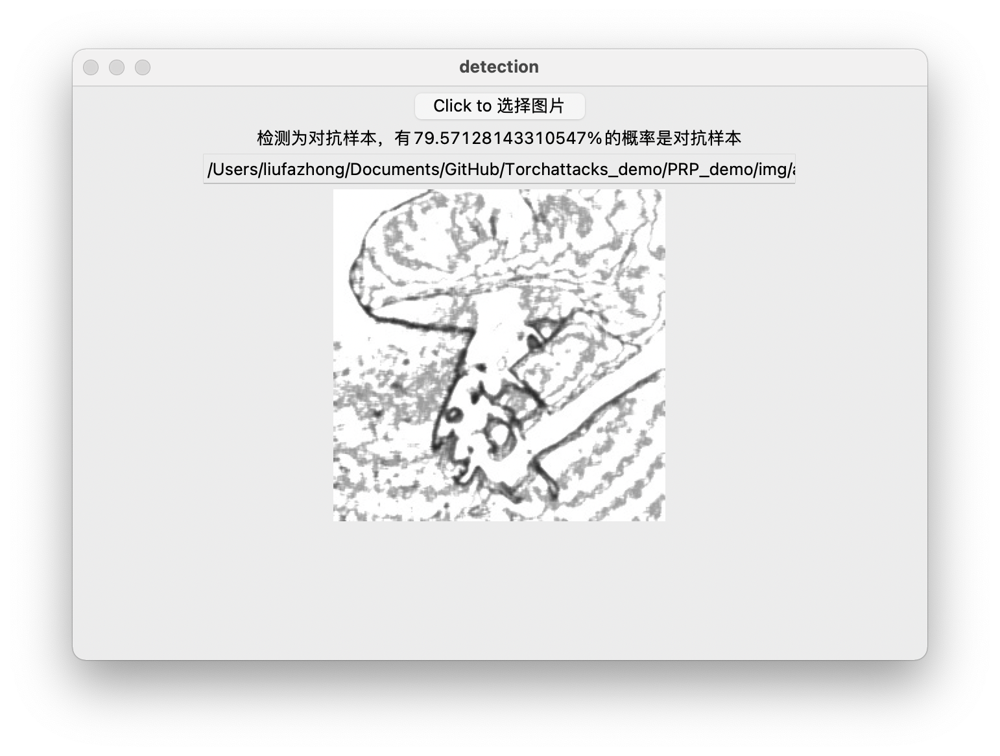

# Adversarial sample detection based on weak dark textures

## Background

Based on the 42nd PRP scientific research program, this project realizes the function of detecting whether images are antagonistic samples according to their gray-scale texture features.

## Usage

Run `./PRP_demo/gui/ui.py` to  invoke the graphical interface. 

Click the button at the top of the interface to select the picture, and the system will automatically detect whether it is a counter sample.

## Related Efforts

The attack section is based on the demo of [adversarial-attacks-pytorch](https://github.com/Harry24k/adversarial-attacks-pytorch).

The network is based on resnet50 net.

## Maintainer

[@faiimea](https://github.com/faiimea)

## Contributors

[@cfg554](https://github.com/cfg554)

## TODO

- [ ] Optimize code structure
- [ ] Optimize GUI interface

## License

MIT 

